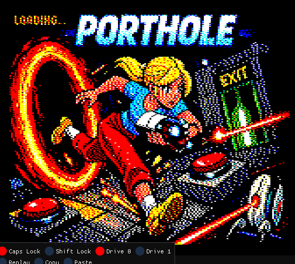
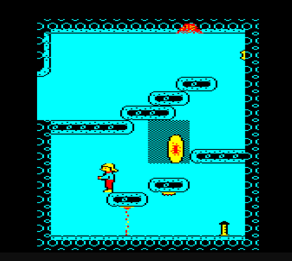
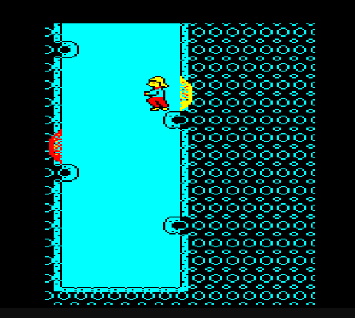
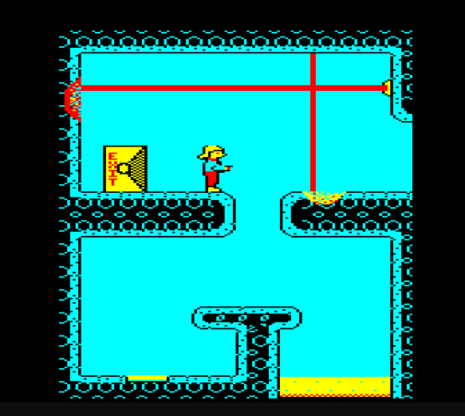

# PORTHOLE

A Portal demake for the BBC Master 128, written in 6502 assembly.



## Screenshots

| Level 1                       | Level 2                       |
| ----------------------------- | ----------------------------- |
|  |  |



## Features

- Dual portals with momentum-preserving teleportation (wall, floor, ceiling, and back-wall orientations)
- Laser beams that redirect through portals and activate targets
- Weighted storage cubes with physics (gravity, portal flinging, button activation)
- Puzzle elements: buttons, pressure pads, exit doors, fizzler fields, cube spawners
- Multi-room levels with screen transitions
- Reticle-based aiming system for portal placement
- MODE 7 teletext interstitial screens

## Requirements

### Build tools

- [BeebAsm](https://github.com/stardot/beebasm) (6502 assembler)
- Python 3.10+
- ImageMagick (`convert` / `identify`)
- Pillow (`pip install Pillow`)

### Running

- [B2 emulator](https://github.com/tom-seddon/b2) (BBC Master 128 mode) or real hardware
- The game targets the **BBC Master 128** specifically (uses shadow RAM and sideways RAM)

## Building

```bash
./build.sh
```

This assembles the source, generates sprite/tile/level data, and produces `porthole.ssd` (a bootable DFS disc image).

## Controls

| Key    | Action                    |
| ------ | ------------------------- |
| Z / X  | Move                      |
| RETURN | Jump                      |
| SHIFT  | Aim reticle               |
| A / S  | Fire blue / orange portal |
| SPACE  | Pick up / drop cube       |
| ESCAPE | Restart level             |

## How it works

The game runs in MODE 5 (4-colour, 160x256) with the BBC Master's shadow RAM providing a double-buffered display. Sprite and tile bitmap data are banked into sideways RAM.

The codebase is split into a render-safe zone (below &3000, visible to both main and shadow RAM) and an update-only zone (above &3000, main RAM only). The main loop alternates between rendering and simulation at 25fps.

Levels are authored as TMX tilemaps (Tiled editor) and converted to assembly data at build time. Sprites are drawn as CSV pixel grids and compiled into pre-shifted MODE 5 screen byte format with masks.

### Emulator tools

The `tools/` directory includes helpers for the B2 emulator's HTTP debug API:

```bash
./tools/b2-reload          # Build + upload SSD + reset
./tools/b2-peek <addr> <n> # Peek at live memory
./tools/b2-poke <addr> <hex> # Poke memory
./tools/asm-nav watch <symbols> --on-change  # Watch variables
```

## Status

Beta. Core gameplay mechanics are complete. Graphics and level design are the current focus. 

## AI Usage

I've used a lot of AI to get the game this far, particularly ChatGPT 5.2 and Claude Opus 4.6, both of which are massive upgrades on their predecessors. As a consequence, I've got this game together is just a few days, and these tools let me take on bigger challenges that I would otherwise be able to handle.     

## Other Resources

I've made notes from other peoples disassemblies and other work. I've included these development notes for reference.

## Licence

This project is a fan-made demake created for educational and entertainment purposes. Portal is a trademark of Valve Corporation.
